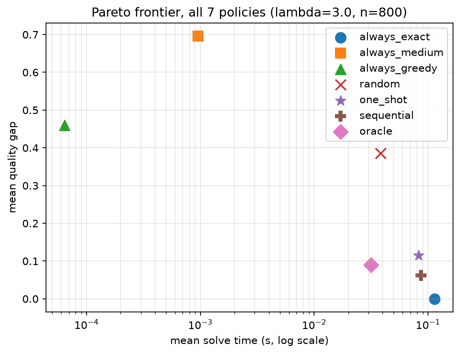
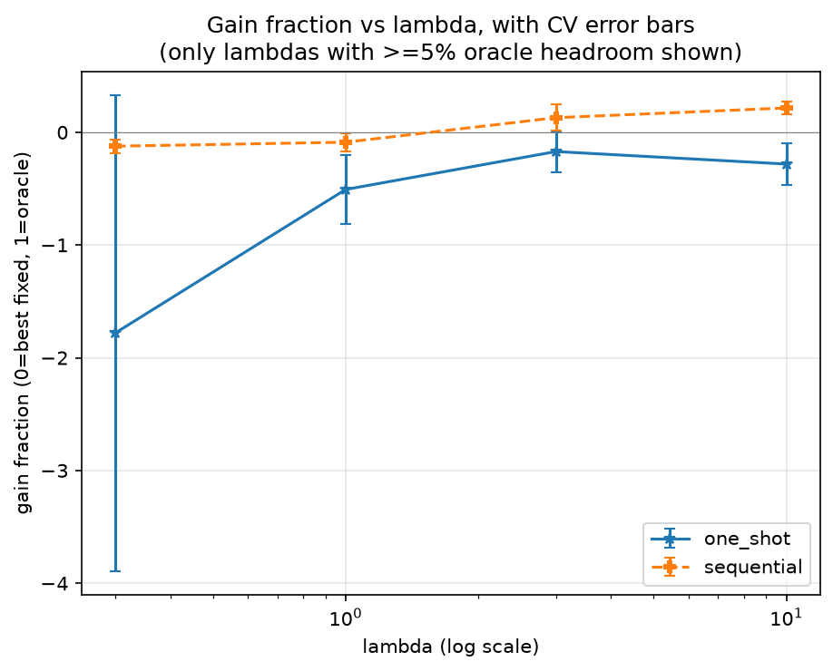

# rungs

> Deciding how hard to think about a problem, before thinking about it.

Optimization systems usually commit to one solving method and apply it to
every instance. But instances differ enormously in how much effort they
deserve, and you can't tell which is which without solving them. This
project predicts per-instance difficulty from cheap, pre-solve features and
allocates solver effort accordingly — and, more interestingly, from evidence
purchased by actually running the cheapest method first and looking at what
happened.

On capacitated facility location, a sequential "run the cheap method, look
at what happened, then decide whether to escalate" policy cuts mean solve
time by **26%** (0.117s → 0.087s) for a **6.8-point** quality-gap cost,
capturing **13–22%** of the improvement available to a perfect oracle across
the range where compute actually costs something.

This is not a new idea — **algorithm selection** was formalized by Rice
(1976); the best-known success is **SATzilla**, which won SAT competitions
predicting per-instance solver runtime from cheap features. The theoretical
frame for "is more thinking worth it" is Russell & Wefald's rational
metareasoning. What's here: sequential escalation solved by backward
induction rather than learned, an oracle-bounded metric (gain fraction,
never an unbounded "X% better"), and an ablation isolating the value of
evidence purchased by running the cheap method first.

## Results

<table>
<tr>
<td width="50%">

**All 7 policies, at the λ where escalation decisions are most mixed.**
The fixed baselines span the tradeoff — `always_exact` is perfect but
slowest, `always_greedy`/`always_medium` are fast but far worse.
`sequential` and `one_shot` land in between; `oracle` is the impossible
ceiling, knowing the right method per instance in hindsight.



</td>
<td width="50%">

**How much of the oracle's achievable improvement each policy actually
captures**, across every λ with real headroom to capture (≥5%, the hour-8
exploitability threshold — see limitations below for what happens under
that bar). `sequential` crosses from negative to positive as λ grows and
compute starts costing something; `one_shot` never does.



</td>
</tr>
</table>

### The three rungs

Capacitated facility location: choose which sites to open and assign every
customer to an open site, minimizing fixed opening costs plus transport
cost, subject to per-site capacity. $f_i$ = fixed cost of site $i$, $c_{ij}$
= transport cost from site $i$ to customer $j$, $d_j$ = demand of customer
$j$, $s_i$ = capacity of site $i$.

**Exact** — mixed-integer program, solved to proven optimality:

$$
\min_{x,\,y} \; \sum_i f_i y_i + \sum_{i,j} c_{ij} x_{ij}
$$

$$
\text{s.t.} \quad \sum_i x_{ij} = 1 \;\; \forall j, \qquad
\sum_j d_j x_{ij} \le s_i y_i \;\; \forall i, \qquad
x_{ij}, y_i \in \{0, 1\}
$$

**Medium** — solve the LP relaxation ($x_{ij}, y_i \in [0,1]$), round the
open/close decision, then greedily reassign customers to open sites:

$$
\hat{y}_i = \mathbb{1}\!\left[y_i^{\text{LP}} \ge 0.5\right]
$$

**Greedy** — open sites by cost-benefit ratio until capacity covers demand,
then assign each customer to the nearest open site with room:

$$
\text{score}_i = \frac{s_i}{f_i + \bar{c}_i}
$$

where $\bar{c}_i$ is the mean transport cost from site $i$ to the
currently unserved customers.

## Reproduce everything

```bash
./run_all.sh
```

Installs dependencies, runs the test suite, solves 800 facility-location
instances across 3 methods once, evaluates both policies via 5-fold
cross-validation, regenerates every figure in `figures/`, and runs the
lightweight knapsack pipeline proving the same library works on a second
domain. Takes a few minutes, dominated by the exact MILP solves.

## What's here

```
config.yaml                 # pre-registered constants: seed, lambda grid, gap penalty
src/rungs/                  # the library
  core.py                   #   Rung / Domain protocols, Allocator (plug in a new domain here)
  policies.py                #   one-shot selector (LightGBM regression per rung)
  sequential.py               #   tabular backward induction for the sequential policy
  evaluate.py                  #   quality_gap, loss, gain_fraction
  domains/
    facility_location*.py       # primary domain: capacitated facility location
    knapsack*.py                 # second domain, proving the plugin interface
src/scripts/                # drivers
  precompute.py               #   solve everything once, build data/cache.parquet
  evaluate_one_shot.py          #   one-shot CV + first Pareto plot
  evaluate_sequential.py         #   sequential CV + cost-accounting check + ablation
  generate_figures.py             #   the full lambda sweep and all 5 figures
  run_knapsack_pipeline.py          #   full pipeline + 2 figures for the second domain
tests/                      # 41 tests, TDD throughout
figures/                    # generated plots
internal/                   # design doc, implementation guide, build-order TODO
```

## Honest limitations

Read this before the numbers above impress you more than they should.

- **Small synthetic instances only** (6 candidate sites, 15 customers) —
  chosen empirically, not from the original design: at the originally
  planned 15×60 scale, the exact MILP solver fails to prove optimality
  within 5s on ~48% of instances even with a stable solver backend. Nothing
  here is claimed about larger or real-world instances.
- **The one-shot ("predict, then commit") policy underperforms the naive
  baseline at every λ tested**, once judged by the combined quality+time
  loss rather than simple Pareto dominance — a real, cross-validated
  negative result, not a bug. The sequential ("run, observe, then decide")
  policy is the one that delivers positive gain, consistent with it being
  the intended headline policy rather than the fallback.
- **Feature-extraction time is the same order of magnitude as the cheapest
  solver** (~60μs vs ~70μs), not "orders of magnitude" smaller as originally
  hoped — a side effect of the instance-size reduction above.
- **The second domain (knapsack) got a lightweight pass, not the full
  treatment**: correctness-tested, proven to plug into the same `Allocator`
  machinery with one small, genuine generalization required (a `sense`
  field, since knapsack maximizes value while facility location minimizes
  cost), and has its own Pareto and gain-fraction figures
  (`figures/knapsack_*.png`) — but no 5-fold cross-validation, just a single
  train/test split. Its own pipeline also surfaced a new limitation: at
  microsecond solve times, wall-clock timing noise (~50% relative stdev)
  makes some cross-policy time comparisons unreliable, and one λ (10,000)
  produces a gain fraction above 1 — logically impossible for a metric
  bounded by the oracle, and excluded from the headline figure for exactly
  that reason.
- **Three of the four analysis scripts are not yet "thin drivers"** over the
  `rungs` library — only `precompute.py` was refactored to route solving
  through `Domain.rungs()`; `evaluate_one_shot.py`, `evaluate_sequential.py`,
  and `generate_figures.py` still import solvers directly.
- Three fixed rungs, not a continuous effort dial. The sequential policy is
  optimal only for the *discretized* state; discretization loss is
  unquantified.

## Future work

- The LLM cascade routing second domain (verifiable-benchmark model
  escalation) named in the original design as preferred over knapsack —
  skipped this round for lack of API budget.
- Finish routing the three remaining scripts through `Allocator`.
- A real write-up (`paper/paper.pdf` in the original design) — this README
  is currently the only narrative document.

